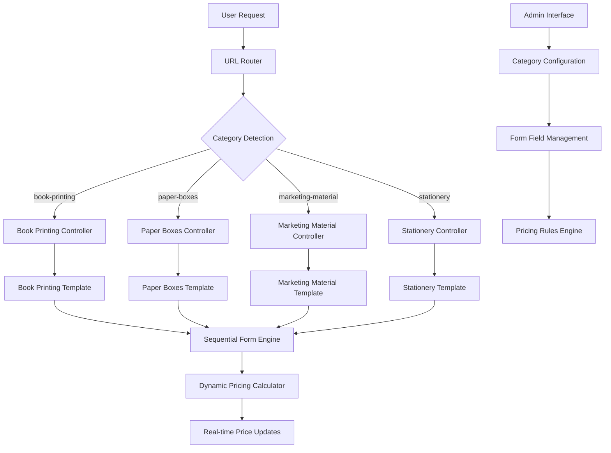

# Design Document

## Overview

This design implements category-specific pricing calculators and form interfaces for product detail pages within the 4 main printing categories (Book printing, Paper Boxes, Marketing Material, Stationery). When users view individual products (like "Children's Book Printing" or "Business Cards"), they will see specialized forms and pricing calculators tailored to that product's category. The category listing pages remain unchanged, but individual product detail pages get enhanced with category-specific functionality that guides users through the ordering process step-by-step.

## Architecture

### High-Level Architecture



### System Components

1. **Category-Specific Controllers**: Handle routing and data preparation for each category
2. **Sequential Form Engine**: Manages step-by-step form progression with dependencies
3. **Dynamic Pricing Calculator**: Real-time price calculations with category-specific rules
4. **Template System**: Category-specific UI templates with shared components
5. **Admin Configuration**: Backend management for form fields and pricing rules

## Components and Interfaces

### 1. Category Detection and Routing

**URL Structure:**
```
/services/book-printing/          # Book printing category page
/services/paper-boxes/            # Paper boxes category page
/services/marketing-material/     # Marketing material category page
/services/stationery/             # Stationery category page
```

**CategoryRouter Component:**
```python
class CategorySpecificView:
    CATEGORY_TEMPLATES = {
        'book-printing': 'services/categories/book_printing.html',
        'paper-boxes': 'services/categories/paper_boxes.html',
        'marketing-material': 'services/categories/marketing_material.html',
        'stationery': 'services/categories/stationery.html'
    }
    
    def get_template_name(self, category_slug):
        return self.CATEGORY_TEMPLATES.get(category_slug, 'services/category_detail.html')
```

### 2. Sequential Form Engine

**Form Section Structure:**
```javascript
class SequentialFormEngine {
    constructor(categoryConfig) {
        this.sections = categoryConfig.sections;
        this.currentSection = 0;
        this.dependencies = categoryConfig.dependencies;
        this.validationRules = categoryConfig.validationRules;
    }
    
    enableNextSection() {
        // Enable next section when current is valid
    }
    
    validateSection(sectionIndex) {
        // Validate current section before progression
    }
    
    resetDependentSections(changedField) {
        // Reset subsequent sections when dependency changes
    }
}
```

**Book Printing Form Configuration:**
```json
{
    "sections": [
        {
            "id": "interior_color",
            "title": "Interior Color",
            "required": true,
            "fields": ["interior_color_option"],
            "dependencies": []
        },
        {
            "id": "book_size_pages",
            "title": "Book Size And Page Count",
            "required": true,
            "fields": ["book_size", "page_count", "bw_page_count", "color_page_count"],
            "dependencies": ["interior_color"]
        },
        {
            "id": "paper_type",
            "title": "Paper Type",
            "required": true,
            "fields": ["paper_selection"],
            "dependencies": ["book_size_pages"]
        }
    ]
}
```

### 3. Dynamic Pricing Calculator

**Category-Specific Pricing Engine:**
```javascript
class CategoryPricingCalculator {
    constructor(category, productData) {
        this.category = category;
        this.basePrice = productData.basePrice;
        this.pricingRules = productData.pricingRules;
        this.modifiers = {};
    }
    
    calculateBookPricing(formData) {
        // Book-specific pricing logic
        let unitPrice = this.basePrice;
        
        // Interior color modifier
        unitPrice += this.getInteriorColorModifier(formData.interior_color);
        
        // Page count pricing
        if (formData.interior_color === 'combine_color') {
            unitPrice += this.calculateCombinedPagePricing(
                formData.bw_page_count, 
                formData.color_page_count
            );
        } else {
            unitPrice += this.calculateStandardPagePricing(
                formData.page_count, 
                formData.interior_color
            );
        }
        
        // Paper type modifier
        unitPrice += this.getPaperTypeModifier(formData.paper_type);
        
        // Binding type modifier (with page count validation)
        unitPrice += this.getBindingModifier(formData.binding_type, formData.page_count);
        
        return this.applyQuantityDiscounts(unitPrice, formData.quantity);
    }
}
```

### 4. Template System Architecture

**Base Category Template Structure:**
```html
<!-- services/categories/base_category.html -->
<div class="category-specific-page">
    <header class="category-header">
        
    </header>
    
    <main class="category-content">
        <div class="form-container">
            
        </div>
        
        <div class="pricing-sidebar">
            
        </div>
    </main>
    
    <aside class="specifications-summary">
        
    </aside>
</div>
```

**Book Printing Specific Template:**
```html
<!-- services/categories/book_printing.html -->



<div class="sequential-form" data-category="book-printing">
    <!-- Section 1: Interior Color -->
    <div class="form-section" data-section="interior_color" data-enabled="true">
        <h3>Interior Color</h3>
        <p>Standard Ink... Premium...</p>
        <!-- Interior color options -->
    </div>
    
    <!-- Section 2: Book Size and Page Count -->
    <div class="form-section" data-section="book_size_pages" data-enabled="false">
        <h3>Book Size And Page Count</h3>
        <!-- Conditional page count fields -->
    </div>
    
    <!-- Additional sections... -->
</div>

```

### 5. Admin Configuration Interface

**Category Form Field Management:**
```python
class CategoryFormFieldAdmin(admin.ModelAdmin):
    list_display = ['category', 'field_name', 'field_type', 'section', 'order', 'is_active']
    list_filter = ['category', 'field_type', 'section', 'is_active']
    ordering = ['category', 'section_order', 'order']
    
    fieldsets = (
        ('Basic Information', {
            'fields': ('category', 'field_name', 'field_label', 'field_type', 'section')
        }),
        ('Display Configuration', {
            'fields': ('order', 'section_order', 'is_required', 'help_text', 'placeholder')
        }),
        ('Options and Validation', {
            'fields': ('options', 'default_value', 'min_value', 'max_value')
        }),
        ('Conditional Logic', {
            'fields': ('show_condition', 'triggers_fields')
        }),
        ('Pricing Configuration', {
            'fields': ('is_price_affecting', 'price_modifier')
        })
    )
```

## Data Models

### Enhanced Category Form Field Model

```python
class CategoryFormField(models.Model):
    FIELD_TYPES = [
        ('text', 'Text Input'),
        ('number', 'Number Input'),
        ('select', 'Select Dropdown'),
        ('radio', 'Radio Buttons'),
        ('checkbox', 'Checkbox'),
        ('range', 'Range Slider'),
        ('file', 'File Upload'),
        ('conditional_group', 'Conditional Field Group'),
    ]
    
    CATEGORIES = [
        ('book-printing', 'Book Printing'),
        ('paper-boxes', 'Paper Boxes'),
        ('marketing-material', 'Marketing Material'),
        ('stationery', 'Stationery'),
    ]
    
    category = models.CharField(max_length=50, choices=CATEGORIES)
    field_name = models.CharField(max_length=100)
    field_label = models.CharField(max_length=200)
    field_type = models.CharField(max_length=20, choices=FIELD_TYPES)
    section = models.CharField(max_length=50)
    section_order = models.IntegerField(default=0)
    order = models.IntegerField(default=0)
    
    # Conditional logic
    show_condition = models.JSONField(blank=True, null=True)
    triggers_fields = models.JSONField(blank=True, null=True)
    
    # Validation rules
    validation_rules = models.JSONField(blank=True, null=True)
    
    # Pricing impact
    is_price_affecting = models.BooleanField(default=False)
    price_modifier_type = models.CharField(max_length=20, choices=[
        ('fixed', 'Fixed Amount'),
        ('percentage', 'Percentage'),
        ('per_unit', 'Per Unit'),
        ('conditional', 'Conditional Logic')
    ], default='fixed')
    price_modifier_value = models.DecimalField(max_digits=10, decimal_places=2, default=0)
    price_modifier_conditions = models.JSONField(blank=True, null=True)
```

### Category-Specific Pricing Rules

```python
class CategoryPricingRule(models.Model):
    category = models.CharField(max_length=50, choices=CategoryFormField.CATEGORIES)
    rule_name = models.CharField(max_length=100)
    rule_type = models.CharField(max_length=20, choices=[
        ('base_price', 'Base Price'),
        ('quantity_tier', 'Quantity Tier'),
        ('option_modifier', 'Option Modifier'),
        ('conditional_pricing', 'Conditional Pricing')
    ])
    
    # Rule configuration
    conditions = models.JSONField(help_text="Conditions for rule application")
    pricing_formula = models.JSONField(help_text="Pricing calculation formula")
    
    # Quantity-based rules
    min_quantity = models.IntegerField(null=True, blank=True)
    max_quantity = models.IntegerField(null=True, blank=True)
    discount_percentage = models.DecimalField(max_digits=5, decimal_places=2, default=0)
    
    is_active = models.BooleanField(default=True)
    created_at = models.DateTimeField(auto_now_add=True)
```

## Error Handling

### Form Validation Strategy

1. **Client-Side Validation:**
   - Real-time field validation as user types
   - Section completion validation before enabling next section
   - File type and size validation for uploads
   - Conditional field validation based on dependencies

2. **Server-Side Validation:**
   - Comprehensive form data validation
   - Business rule validation (e.g., minimum page counts for binding types)
   - File security validation
   - Pricing calculation validation

3. **Error Display:**
   - Inline field-level error messages
   - Section-level validation summaries
   - Global form error notifications
   - Graceful fallbacks for JavaScript failures

### Pricing Calculation Error Handling

```javascript
class PricingErrorHandler {
    handleCalculationError(error, context) {
        console.error('Pricing calculation error:', error);
        
        // Show user-friendly error message
        this.showErrorMessage('Unable to calculate price. Please check your selections.');
        
        // Maintain last valid price
        this.revertToLastValidPrice();
        
        // Log error for debugging
        this.logError(error, context);
    }
    
    validatePricingInputs(formData) {
        const errors = [];
        
        if (!formData.quantity || formData.quantity < 25) {
            errors.push('Minimum quantity is 25 pieces');
        }
        
        if (formData.page_count && formData.page_count < 4) {
            errors.push('Minimum page count is 4 pages');
        }
        
        return errors;
    }
}
```

## Testing Strategy

### Unit Testing

1. **Form Field Validation Tests:**
   - Test each field type validation
   - Test conditional field logic
   - Test section progression rules

2. **Pricing Calculation Tests:**
   - Test base price calculations
   - Test modifier applications
   - Test quantity discount calculations
   - Test category-specific pricing rules

3. **Template Rendering Tests:**
   - Test category-specific template selection
   - Test form field rendering
   - Test conditional field display

### Integration Testing

1. **End-to-End Form Flow:**
   - Test complete book printing form submission
   - Test form validation and error handling
   - Test pricing calculator integration

2. **Category Switching:**
   - Test navigation between categories
   - Test form state preservation
   - Test pricing rule switching

3. **Admin Interface Testing:**
   - Test form field management
   - Test pricing rule configuration
   - Test category configuration updates

### Performance Testing

1. **Form Rendering Performance:**
   - Test page load times for each category
   - Test form field rendering performance
   - Test conditional field show/hide performance

2. **Pricing Calculation Performance:**
   - Test real-time pricing calculation speed
   - Test complex pricing rule evaluation
   - Test large quantity calculations

## Security Considerations

### Input Validation

1. **Form Data Sanitization:**
   - Sanitize all user inputs
   - Validate file uploads (type, size, content)
   - Prevent XSS attacks in form fields

2. **Pricing Calculation Security:**
   - Server-side price validation
   - Prevent client-side price manipulation
   - Audit trail for pricing calculations

3. **File Upload Security:**
   - Restrict file types to safe formats
   - Scan uploaded files for malware
   - Store uploads in secure location

### Access Control

1. **Admin Interface Security:**
   - Role-based access to category configuration
   - Audit logging for configuration changes
   - Secure API endpoints for pricing rules

2. **Form Submission Security:**
   - CSRF protection on all forms
   - Rate limiting for form submissions
   - Secure session management

## Performance Optimization

### Frontend Optimization

1. **JavaScript Performance:**
   - Lazy load category-specific JavaScript
   - Debounce pricing calculations
   - Optimize DOM manipulation for conditional fields

2. **CSS Optimization:**
   - Category-specific CSS loading
   - Minimize layout shifts during form progression
   - Optimize animations and transitions

### Backend Optimization

1. **Database Optimization:**
   - Index category and form field queries
   - Cache pricing rules and configurations
   - Optimize form field retrieval queries

2. **Template Optimization:**
   - Cache category-specific templates
   - Minimize template inheritance depth
   - Optimize form field rendering loops

## Deployment Strategy

### Database Migration Plan

1. **Phase 1: Add New Models**
   - Create CategoryFormField model
   - Create CategoryPricingRule model
   - Migrate existing form fields to new structure

2. **Phase 2: Update Templates**
   - Create category-specific templates
   - Update URL routing
   - Implement sequential form engine

3. **Phase 3: JavaScript Integration**
   - Deploy new pricing calculator
   - Implement conditional field logic
   - Add form validation

### Rollback Strategy

1. **Template Fallback:**
   - Maintain existing generic templates as fallback
   - Feature flag for category-specific pages
   - Gradual rollout by category

2. **Data Preservation:**
   - Preserve existing form field configurations
   - Maintain backward compatibility
   - Export/import tools for configuration migration